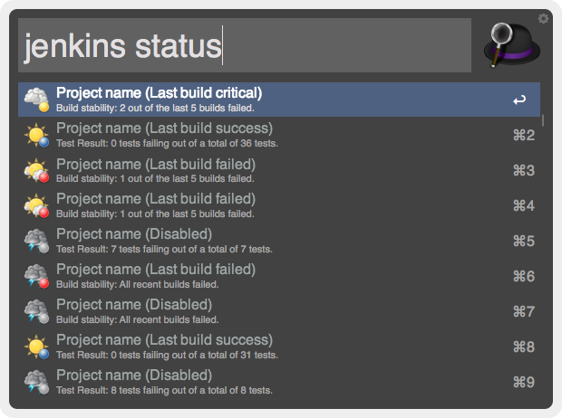

# Jenkins workflow for Alfred v2
A configurable workflow for Alfred v2 which lets you list Jenkins jobs and see their status.

## Usage

Typing `jenkins` followed by part of the job you're looking for will list all matching results.

For example, `jenkins php` could return:

* **phpunit**  
* **zend-php**
* **elephpant**

## Commands

The commands currently supported by this workflow are:

* **jenkins status {query}**  
`This returns the current status for all jobs matching {query}`

## About

This workflow is developed by [@RevellNL](https://twitter.com/RevellNL)
